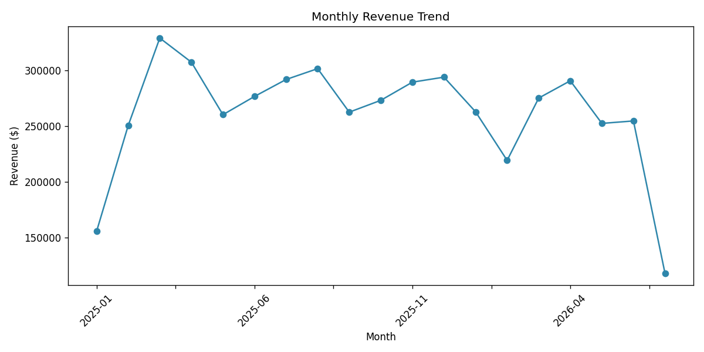
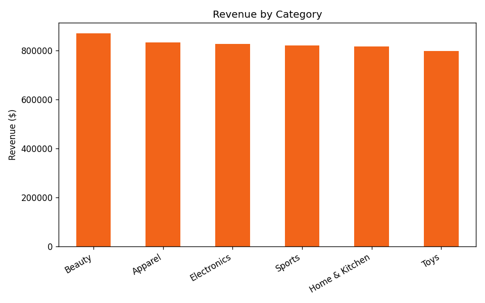
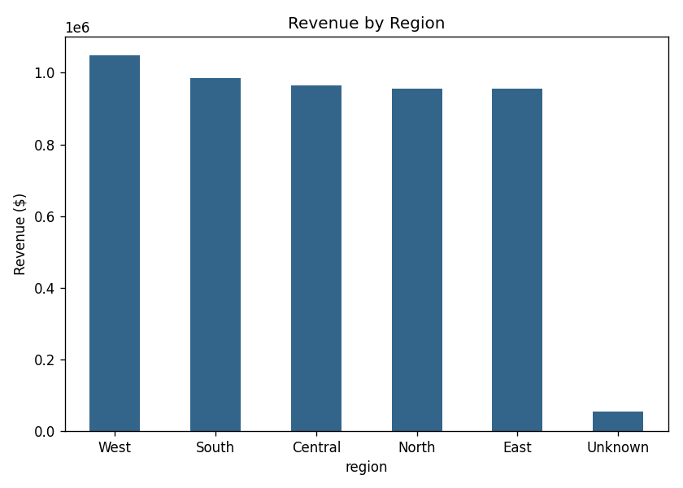
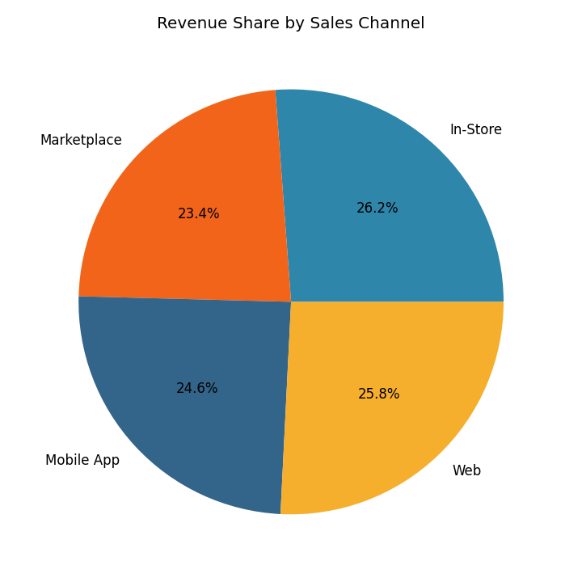

# E-Commerce Sales: Data Cleaning & Exploratory Analysis

A realistic, end-to-end data cleaning and EDA project simulating a common analyst task:
turning a messy, multi-source operational export into a trustworthy dataset and a set
of business-ready insights.

## Problem

The raw export (`data/raw_sales_data.csv`, 5,075 rows) mirrors what actually lands on
an analyst's desk: duplicate rows from retry logic, missing revenue and region fields,
inconsistent category casing across systems, mixed date formats, and sign errors on
quantity. None of this is usable for reporting until it's cleaned and validated.

## Approach

1. **Audit first**: quantify every quality issue before touching the data (see console
   output in `clean_and_analyze.py`), so the cleaning is justified, not guessed.
2. **Clean without discarding data unnecessarily**:
   - Dropped 75 exact duplicate rows
   - Standardized 18 inconsistent category spellings down to 6 canonical categories
   - Recomputed 151 missing `revenue` values from `unit_price × quantity` instead of
     deleting those rows
   - Filled 49 missing `region` values with `"Unknown"` (explicit, trackable) rather
     than silently dropping revenue from totals
   - Corrected 109 negative-quantity data-entry errors
   - Normalized two different date formats (`YYYY-MM-DD` and `DD/MM/YYYY`) into one
     consistent datetime column
3. **Analyze**: monthly revenue trend, revenue by category, by region, and by sales
   channel.

## Results

| Metric | Value |
|---|---|
| Total revenue analyzed | R4,965,571.57 |
| Top-performing category | Beauty (R870,115.39) |
| Top-performing region | West (R1,048,884.03) |
| Best month | March 2025 (R329,207.37) |






**Business insight flagged to stakeholders**: 1.12% of revenue is tied to orders with
an unrecorded region, pointing to a data-capture gap at checkout in one of the source
systems rather than an analysis error. It's the kind of finding that should go back to
the engineering team, not just get buried in an "Unknown" bucket.

## What I'd do at scale

- Move the cleaning logic into a dbt model or Airflow DAG so it runs on every new
  batch instead of manually, with the audit counts logged as data-quality metrics
  over time (see the `project-4-etl-pipeline` project for that pattern).
- Add automated tests (e.g. `category` must be one of N known values, `revenue`
  must equal `unit_price × quantity`) using something like Great Expectations.

## Tech stack

Python, pandas, numpy, matplotlib

## Run it yourself

```bash
pip install pandas numpy matplotlib faker
python3 generate_data.py       # creates data/raw_sales_data.csv
python3 clean_and_analyze.py   # cleans, analyzes, saves charts to images/
```
