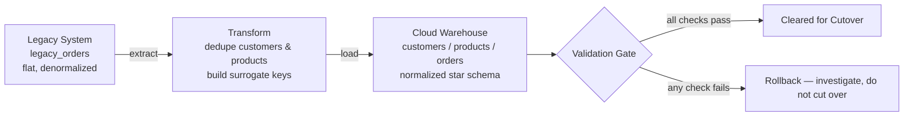

# Legacy-to-Cloud Data Migration (with Validation Gate)

A simulated but realistic data migration: a flat, denormalized legacy
system (standing in for an on-prem SQL Server / Oracle system) migrated
into a normalized star schema (standing in for a cloud warehouse like
Snowflake, BigQuery, or Azure SQL), with an automated validation suite
that has to pass before the migration is considered safe to cut over.

This is the project most analyst portfolios don't have — it's here
because migration work (planning, executing, and *proving* a migration
didn't lose or corrupt data) is its own discipline, distinct from
analysis.

## Architecture



## Migration plan

1. **Extract** — read every row from the legacy `legacy_orders` table
   as-is, no assumptions about which fields are "safe" to drop.
2. **Transform** — deduplicate repeated customer and product data into
   proper dimension tables (`customers`, `products`), generating
   surrogate keys, and build a normalized `orders` fact table referencing
   them by foreign key.
3. **Load** — write the normalized schema into the target warehouse
   database inside a single transaction.
4. **Validate** — run 6 automated checks before declaring success:
   - Row count reconciliation between source and target
   - Aggregate revenue matches exactly, pre- and post-migration
   - No orphaned foreign keys (every order resolves to a real customer
     and product)
   - Customer deduplication is exactly correct (unique emails in source
     == customer rows in target)
   - No dropped records (every source `order_id` exists in the target)
5. **Cutover / rollback decision** — the validation script exits non-zero
   on any failure, so in a real pipeline this becomes a CI/CD gate: a
   failed check blocks cutover automatically rather than relying on
   someone remembering to check a dashboard.

## Results

All 6 validation checks passed on this run:

```
[PASS] Row count reconciliation (orders) -- source=4000, target=4000
[PASS] Aggregate revenue matches pre/post migration -- source=$1,023,732.37, target=$1,023,732.37
[PASS] No orders with orphaned customer_id -- orphans=0
[PASS] No orders with orphaned product_id -- orphans=0
[PASS] Customer deduplication correct -- source unique emails=300, target customers=300
[PASS] No dropped order records -- missing=0

ALL 6 VALIDATION CHECKS PASSED -- migration cleared for cutover
```

4,000 denormalized order records were consolidated into 300 unique
customers and 8 unique products, with zero data loss and zero revenue
drift.

## Rollback strategy

Because the legacy system is never modified during migration (extract
is read-only) and the target database is built fresh each run, rollback
is simply: don't point downstream consumers at the new warehouse until
the validation gate passes. In a real cloud migration this maps to
blue/green cutover — the legacy system stays live and authoritative
until validation clears, then traffic switches over, with the old
system kept warm for a defined rollback window.

## What I'd do at scale

- Replace SQLite stand-ins with the real source (e.g. SQL Server) and
  target (e.g. Snowflake) and run extraction in batches with checkpointing
  for tables too large to hold in memory
- Add a reconciliation report emailed to stakeholders after every run,
  not just console output
- Version the schema migration itself (e.g. with Alembic/Flyway) so
  future changes are tracked

## Tech stack

Python, sqlite3, SQL (DDL + validation queries), logging

## Run it yourself

```bash
python3 01_create_legacy_system.py   # builds the simulated legacy source
python3 02_migrate.py                # extract, transform, load into cloud_warehouse.db
python3 03_validate_migration.py     # runs the 6-check validation gate
```
