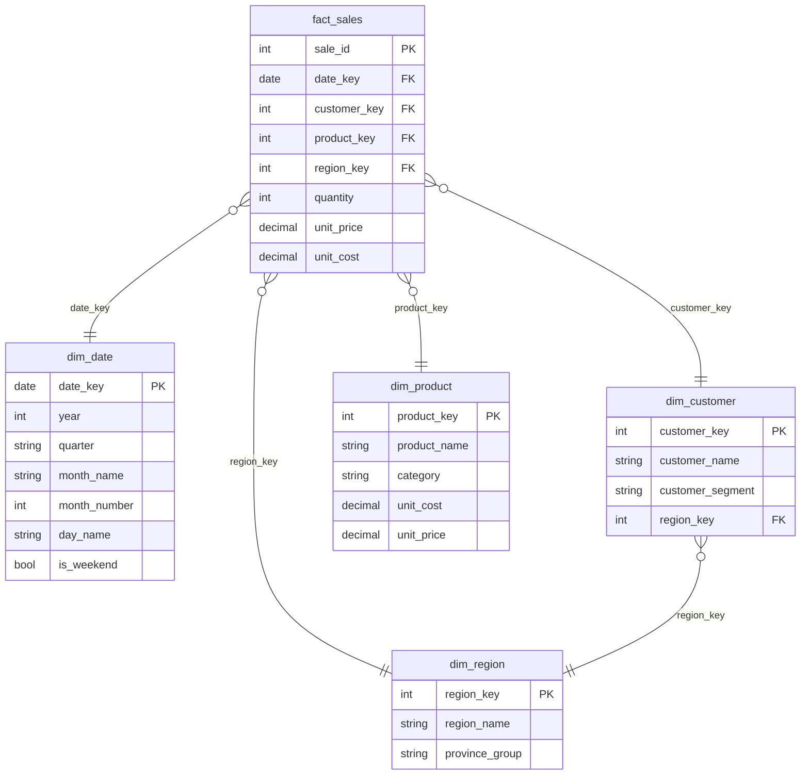

# Data Model

A star schema: one fact table at the sales-transaction grain, surrounded
by four dimension tables. This is the standard shape for a Power BI
model built for performance and usable time intelligence, rather than a
single flat table.

## Entity relationship diagram

## Tables

| Table | Grain | Rows | Purpose |
|---|---|---|---|
| `fact_sales` | One row per sale | 6,841 | Transaction-level quantity, price, and cost |
| `dim_date` | One row per calendar day | 912 | Marked as a Date Table in Power BI, powers all time intelligence |
| `dim_customer` | One row per customer | 250 | Customer segment (New / Returning / Loyalty) and home region |
| `dim_product` | One row per product | 30 | Category, cost, and list price |
| `dim_region` | One row per South African province grouping | 5 | Gauteng, Western Cape, KwaZulu-Natal, Eastern Cape, Free State |

## Relationships to set up in Power BI

After loading all five CSVs (Get Data > Text/CSV for each), go to Model
view and create these relationships (all one-to-many, single direction,
from the dimension's key to the fact table):

1. `dim_date[date_key]` (1) to `fact_sales[date_key]` (many)
2. `dim_customer[customer_key]` (1) to `fact_sales[customer_key]` (many)
3. `dim_product[product_key]` (1) to `fact_sales[product_key]` (many)
4. `dim_region[region_key]` (1) to `fact_sales[region_key]` (many)
5. `dim_region[region_key]` (1) to `dim_customer[region_key]` (many)

Then: right-click `dim_date` in the Fields pane, choose **Mark as Date
Table**, and select `date_key` as the date column. This is required
before `Revenue YoY %` and `Revenue Rolling 3M` in `dax/measures.dax`
will calculate correctly.

## Why a star schema instead of one flat table

A single denormalized export (like the raw CSV most people start from)
works for a quick chart, but breaks down for a real report: it repeats
customer and product attributes on every row, makes relationships
between customers and regions ambiguous, and blocks Power BI's
time-intelligence functions, which expect a proper marked date table.
Splitting into fact and dimension tables keeps the model small, keeps
filters propagating correctly across visuals, and matches how these
reports get built in production BI environments.
